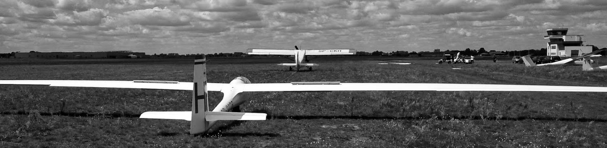

	
	<h1 class="mt-5 mb-5 text-left">
		
			hello there
		
	</h1>
	
 My name is Michal. I am a software developer with heavy aviation engineering background. 

	
 During studies, I’ve quickly discovered my interest in software engineering. Since then I decided to gain skills in that area. For the last 2 years I’ve been working as a software developer in a IT company, mostly creating desktop applications. Currently I’m developing skills into web development.

	
Feel free to read my resume, or to follow projects I've created. 

	

